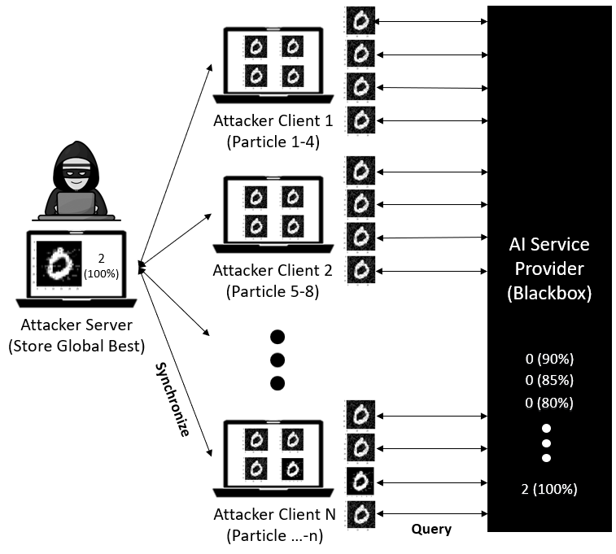

# A Distributed Black-Box Adversarial Attack Based on Multi-Group Particle Swarm Optimization
### By: Naufal Suryanto, Hyoeun Kang, Yongsu Kim, Youngyeo Yun, Harashta Tatimma Larasati, Howon Kim

Paper Source: [A Distributed Black-Box Adversarial Attack Based on Multi-Group Particle Swarm Optimization](https://www.mdpi.com/1424-8220/20/24/7158/htm)